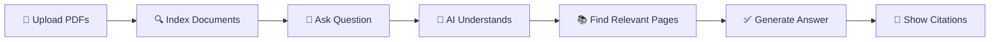

# 🎓 AI Study Assistant

<div align="center">


**An intelligent study companion that helps you learn from your PDF documents**

[](https://github.com/momen223/AI_study-)
[](https://github.com/momen223/AI_study-)
[](https://github.com/momen223/AI_study-)

</div>

---

## 📚 What is AI Study Assistant?

**AI Study Assistant** is a smart Q&A system designed for students and researchers. Instead of reading through hundreds of pages to find answers, you can:

- 🗣️ **Ask questions** about your documents and get accurate, well-explained answers
- 📄 **Upload your own PDFs** (lecture notes, textbooks, research papers)
- 📝 **Generate quizzes** automatically to test your understanding
- 🔍 **See exactly where answers come from** - with page citations and source highlighting

---

## ✨ Key Features

<div align="center">

| Feature | Description |
|---------|-------------|
| 🎯 **Smart Answers** | Get accurate answers grounded in your actual documents |
| 🚫 **No Hallucination** | If the answer isn't in your documents, it says "I don't know" |
| 📖 **Transparent Sources** | See exactly which pages and sections the answer came from |
| 📝 **Quiz Generation** | Automatically create multiple-choice quizzes from your materials |
| 🎨 **Modern UI** | Clean, beautiful interface with dark/light themes |
| 🔒 **Privacy First** | Your documents stay on your machine - no data sent to third parties |

</div>

---

## 🎨 Screenshots

<div align="center">

### 💬 Chat Interface


*Ask questions and get well-explained answers with proper citations*

### 📚 Document Library


*Upload and manage your study materials*

</div>

---

## 🚀 Quick Start

### Prerequisites

- Python 3.10-3.12
- Node.js 18+ (for the web interface)
- An API key for Groq or OpenRouter (or use LM Studio for local AI)

### 1️⃣ Install Python dependencies

```bash
pip install -r requirements.txt
```

### 2️⃣ Set up your AI provider

```bash
# Copy the example config
cp .env.example .env

# Edit .env and add your API key (from Groq or OpenRouter)
```

### 3️⃣ Build the search index and start the server

```bash
python scripts/build_vectorstore.py --all   # Process the demo documents
python app.py                                # Start the API server
```

### 4️⃣ Start the web interface

```bash
cd frontend
npm install
npm run dev
```

Open **http://localhost:5173** in your browser and start asking questions! 🎉

---

## 📁 Project Structure

```
AI_study-/
├── 📂 src/                    # Core AI logic
│   ├── 📂 agents/             # The "brain" - understands and answers questions
│   ├── 📂 quizzes/            # Quiz generation system
│   ├── ⚙️ config.py           # Settings (can be changed via environment)
│   └── 🧠 rag.py              # Main question-answering engine
├── 📂 api/                    # Web server (Flask)
├── 📂 frontend/               # Web interface (React + TypeScript)
├── 📂 tests/                  # Automated tests
├── 📂 scripts/                # Helper tools
├── 📂 data/                   # Demo documents (included)
└── 📂 docs/                   # Documentation
```

---

## 🎯 How It Works



---

## 🛠️ API Endpoints

| Method | Endpoint | Description |
|--------|----------|-------------|
| `GET` | `/api/health` | Check if the server is running |
| `GET` | `/api/libraries` | List available document libraries |
| `POST` | `/api/chat` | Ask a question |
| `POST` | `/api/documents/upload` | Upload a new PDF |
| `POST` | `/api/quizzes` | Generate a quiz |

---

## 📝 Example Usage

### Ask a question

```json
{
  "question": "What is a fact table?",
  "library": "data_warehousing"
}
```

### Generate a quiz

```json
{
  "library": "data_warehousing",
  "question_count": 5,
  "difficulty": "mixed"
}
```

---

## 🎨 Customization

### Themes

The app supports both **light** and **dark** themes. Click the theme toggle in the top right corner to switch between them.

### Colors

The app uses a modern **teal-on-ink** color scheme:

- **Primary:** Teal (`#0e9488`)
- **Background:** Soft gray (`#f4f6f7`) for light, deep ink (`#0a0e13`) for dark
- **Text:** Dark ink (`#0f1526`) for light, soft white (`#e9eff6`) for dark

---

## 📚 Documentation

- [Architecture](docs/architecture/ARCHITECTURE.md) - How the system works
- [Testing](docs/testing/TESTING.md) - How we test everything
- [Benchmarks](docs/testing/BENCHMARK.md) - Performance results

---

## 🤝 Contributing

Contributions are welcome! Please feel free to submit a Pull Request.

1. Fork the repository
2. Create your feature branch (`git checkout -b feature/AmazingFeature`)
3. Commit your changes (`git commit -m 'Add some AmazingFeature'`)
4. Push to the branch (`git push origin feature/AmazingFeature`)
5. Open a Pull Request

---

## 📄 License

This project is licensed under the MIT License - see the [LICENSE](LICENSE) file for details.

---

## 🙏 Acknowledgments

- Built with ❤️ by [momen223](https://github.com/momen223)
- Thanks to all the contributors who helped make this project better

---

<div align="center">

**⭐ Star this repository if you find it helpful! ⭐**

Made with ❤️ for students everywhere

</div>