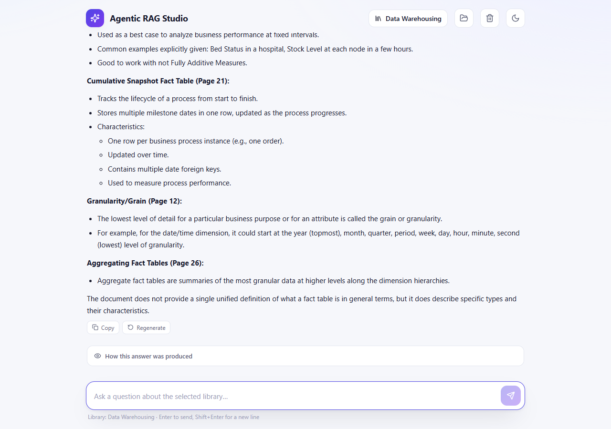
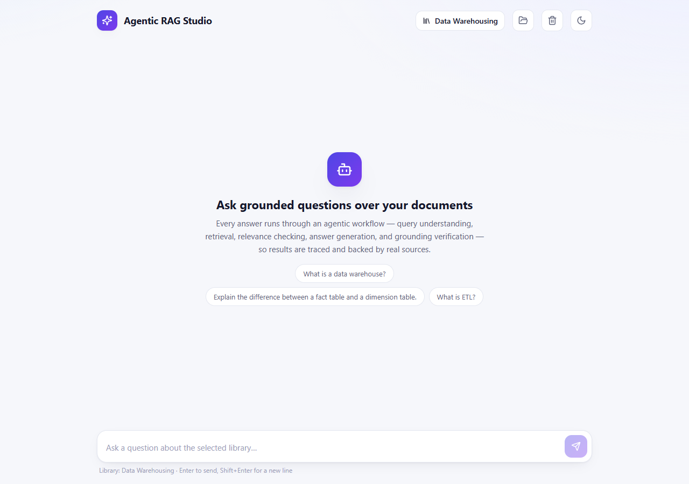

# Agentic RAG Studio

A **subject-agnostic, agentic Retrieval-Augmented Generation (RAG)** system: ask
questions over any set of PDF documents and get answers that are genuinely
grounded in the retrieved sources — with full transparency into *how* each
answer was produced.

It ships as a clean, self-contained project:

- **`src/`** — the production RAG core (a linear agent pipeline)
- **`api/`** — a Flask REST API over the core
- **`frontend/`** — a modern React + TypeScript web UI (Vite)
- **`tests/`** — automated, self-contained test batteries
- **`scripts/`** — helpers to regenerate the demo corpus and build vector stores
- **`data/`** — the bundled demo corpus (committed)

> Everything in this repository is intentionally **generic**. The agents never
> know that the default corpus is about Data Warehousing — the same code answers
> questions from Machine Learning, Networks, or Database PDFs unchanged, and from
> any PDF you upload.

---

## Highlights

- **Agentic pipeline with a hard safety gate.** Questions pass through Query
  Understanding → Rewriting → Retrieval → Relevance → Answer Generation →
  Grounding. A question judged **off-topic never reaches the answer generator**,
  and every delivered answer must **pass grounding** against the retrieved
  sources or it is discarded in favor of a safe `"I don't know…"` response.
- **No hallucination in production.** Answers are only emitted when they are
  supported by the retrieved context. Unknown / out-of-scope questions are
  refused (100% rejection in the test battery).
- **Transparent trace.** The UI shows the rewritten question, relevance verdict,
  grounding verdict, and page-level citations with scores for every answer.
- **Multi-library.** Chat against the default Data Warehousing corpus or any of
  the bundled subject corpora (Machine Learning, Computer Networks, Database
  Systems) — or upload your own PDFs and chat over a brand-new library.
- **MCQ quiz generation.** Automatically generate grounding-validated,
  four-option multiple-choice quizzes over any library. Every question is
  verified against the retrieved context (question, correct answer, and
  explanation must all be supported) before it is accepted; duplicates are
  removed; and answers are hidden until submission with server-side scoring
  and optional time limits.
- **LLM failover.** Groq, OpenRouter, and a fully-local LM Studio backend are
  supported. If every provider is unavailable, agents return a structured
  "providers unavailable" result rather than guessing.
- **Self-contained and reproducible.** The demo corpus is committed; vector
  stores are rebuilt with one command.

---

## Screenshots

**Chat with a grounded answer** — note the relevance/grounding verdict, page
citations, and the "How this answer was produced" transparency panel.



**Empty state** — the library picker and grounded-question prompt.



---

## Quickstart

### Prerequisites

- Python **3.10–3.12**
- Node **18+** and npm (for the web UI)
- An API key for **Groq** or **OpenRouter** (or a running [LM Studio](https://lmstudio.ai)
  server for fully-local inference)

### 1. Install Python dependencies

```bash
pip install -r requirements.txt
```

### 2. Configure the LLM

```bash
cp .env.example .env      # Windows: copy .env.example .env
```

Open `.env` and fill in at least one provider key (see comments in the file).
**Never commit `.env`** — it is git-ignored.

### 3. Build the vector stores and start the API

```bash
python scripts/build_vectorstore.py --all   # builds all 4 demo stores
python app.py                                # or: python -m api.app
```

The API listens on `http://127.0.0.1:5001` by default.

### 4. Run the web UI

```bash
cd frontend
npm install
npm run dev
```

Open `http://localhost:5173` — the Vite dev server proxies `/api` to the Flask
backend, so you can start chatting immediately.

---

## Quick verification

```bash
# 1) Health
Invoke-RestMethod http://127.0.0.1:5001/api/health     # (PowerShell)

# 2) Ask a question (default library = data_warehousing)
$body = @{ question = "What is a fact table?" } | ConvertTo-Json
Invoke-RestMethod -Method Post -Uri http://127.0.0.1:5001/api/chat `
  -ContentType "application/json" -Body $body

# 3) List available libraries
Invoke-RestMethod http://127.0.0.1:5001/api/libraries
```

---

## Repository layout

```
github_release/
├── src/                    # Production RAG core (Python)
│   ├── agents/             #   workflow + 6 agent modules
│   ├── quizzes/            #   MCQ quiz generation (subject-agnostic)
│   ├── config.py           #   all tuning parameters (env-overridable)
│   ├── rag.py              #   run_rag / ask_question entry points
│   ├── ingestion, chunking, embeddings, cromaDB, llm, retriever, relevance
├── api/                    # Flask REST API (app.py + libraries.py + quizzes.py)
├── frontend/               # React + TypeScript web UI (Vite)
├── tests/                  # self-contained test batteries
├── scripts/                # demo generator + vector-store builder
├── data/                   # bundled demo corpus (PDFs committed)
├── docs/
│   ├── architecture/       # ARCHITECTURE.md
│   └── testing/            # TESTING.md, BENCHMARK.md
├── .env.example
├── .gitignore
├── requirements.txt
├── LICENSE
└── README.md
```

---

## API reference

| Method | Route | Description |
|--------|-------|-------------|
| `GET` | `/api/health` | Readiness probe |
| `GET` | `/api/libraries` | List available libraries + availability |
| `POST` | `/api/chat` | Ask a question (`{question, history?, library?}`) |
| `GET` | `/api/documents` | List uploads and ingest status |
| `POST` | `/api/documents/upload` | Upload a PDF (`multipart/form-data`, field `file`) |
| `POST` | `/api/documents/process` | Embed an uploaded PDF into a new library |
| `DELETE` | `/api/documents/<file_id>` | Remove an upload / library |
| `POST` | `/api/quizzes` | Generate an MCQ quiz over a library (`{library, question_count?, difficulty?, topic?, time_limit_seconds?}`) |
| `GET` | `/api/quizzes/<quiz_id>` | Fetch the quiz (correct answers **hidden** until submission) |
| `POST` | `/api/quizzes/<quiz_id>/start` | Start an attempt (records `started_at`) |
| `POST` | `/api/quizzes/<quiz_id>/submit` | Submit answers; returns server-scored result and reveals correct answers |
| `GET` | `/api/quizzes/<quiz_id>/result` | Fetch the latest attempt's result |
| `DELETE` | `/api/quizzes/<quiz_id>` | Delete a quiz |

`POST /api/chat` returns **safe structured metadata only** — never raw
chain-of-thought:

```jsonc
{
  "answer": "A fact table stores the numeric measures...",
  "result": "ANSWERED",            // ANSWERED | UNKNOWN | NOT_RELEVANT | FAILED_VERIFYING | RATE_LIMITED | ERROR
  "is_unknown": false,
  "relevance": { "verdict": "RELEVANT", "reason": "...", "best_score": 0.31, "strong_count": 2, "relevant_count": 4 },
  "grounding": { "verdict": "PASS", "status": "PASS" },
  "citations": [ { "source": "Lecture 4.pdf", "page": 3, "score": 0.31, "snippet": "..." } ],
  "sources": ["Lecture 4.pdf"],
  "processing_ms": 1234
}
```

### Generating an MCQ quiz

```powershell
$body = @{
  library         = "data_warehousing"
  question_count  = 5
  difficulty      = "mixed"           # easy | medium | hard | mixed
  time_limit_seconds = 300            # optional; 0 = no time limit
} | ConvertTo-Json

# 1) Create the quiz (returns quiz_id; correct answers are NOT included)
$quiz = Invoke-RestMethod -Method Post -Uri http://127.0.0.1:5001/api/quizzes `
  -ContentType "application/json" -Body $body

# 2) Start an attempt, then submit answers
$start = Invoke-RestMethod -Method Post `
  -Uri "http://127.0.0.1:5001/api/quizzes/$($quiz.quiz_id)/start"
$sub = @{ answers = @{ q1 = "A"; q2 = "B" } } | ConvertTo-Json
$result = Invoke-RestMethod -Method Post `
  -Uri "http://127.0.0.1:5001/api/quizzes/$($quiz.quiz_id)/submit" `
  -ContentType "application/json" -Body $sub

$result | ConvertTo-Json -Depth 4   # server-scored: score / total / correct map
```

Quiz generation is fully grounding-validated: a question (stem, correct answer,
and explanation) is only accepted if it is supported by the retrieved context,
and near-duplicate questions are removed. Correct answers live only server-side
until `submit`; scoring is always recomputed on the server. A quiz can be
generated over any library (default or uploaded), and retrieves its own context
using dedicated `QUIZ_*` MMR settings so it does not perturb the chat pipeline.

---

## Documentation

- [Architecture](docs/architecture/ARCHITECTURE.md) — the agent pipeline, trace
  shape, config, and design rules.- [Testing](docs/testing/TESTING.md) — how the project is verified.
- [Benchmark](docs/testing/BENCHMARK.md) — measured results across all suites.

---

## License

[MIT](LICENSE) — © 2026 AI Study Assistant.
